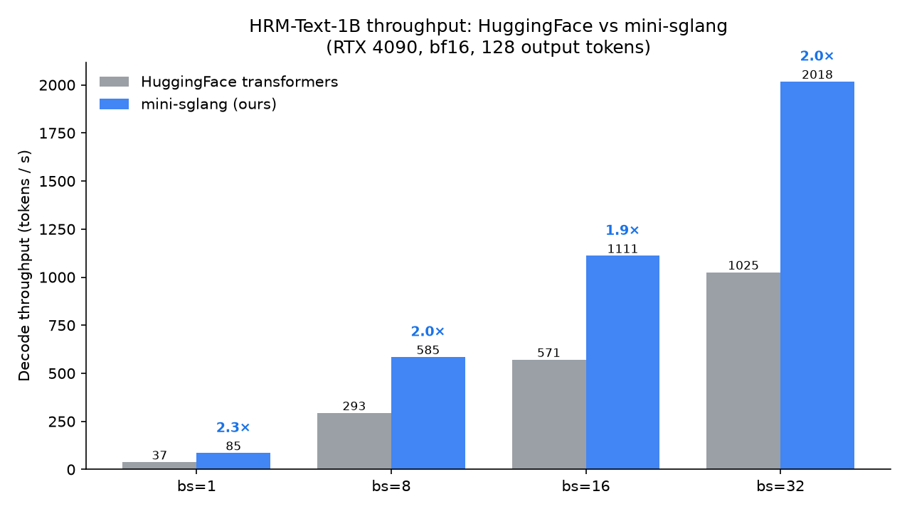

# HRM-Text-1B on mini-sglang

High-throughput serving of the **HRM-Text-1B** Hierarchical Reasoning Model through a custom
[mini-sglang](mini-sglang) backend — with an **OpenAI-compatible API**, output parity verified
against HuggingFace `transformers`, and **~2× the decode throughput** of `transformers` on the
same GPU.

> HRM is a dual-timescale **recurrent** transformer: a high-level (`H`) and a low-level (`L`)
> transformer stack iterate over the same embeddings for `H_cycles × (L_cycles + 1)` steps.
> Serving it efficiently means mapping that recurrence onto a paged-KV inference engine.

---

## Highlights

- ⚡ **~2× faster than HuggingFace `transformers`** across batch sizes — up to **2018 tok/s** at bs=32 on a single RTX 4090.
- 🚀 **~3500 tok/s** output throughput at concurrency 64, **TPOT ~12–17 ms**, and **0 errors** under a 300-request stress test.
- ✅ **Parity-verified** — 100 % teacher-forced argmax agreement with the HF reference (bf16).
- 🔌 **OpenAI SDK compatible** `/v1/chat/completions` (streaming + non-streaming).
- 🛠️ **Profiler-driven** optimization (fused RMSNorm + fewer copies): −55 % CPU launch overhead, +17 % throughput.

## Throughput vs. HuggingFace



| Batch size | HF `transformers` (tok/s) | mini-sglang (tok/s) | Speedup |
|---:|---:|---:|:--:|
| 1  | 37   | 85   | **2.3×** |
| 8  | 293  | 585  | **2.0×** |
| 16 | 571  | 1111 | **1.9×** |
| 32 | 1025 | 2018 | **2.0×** |

<sub>1× RTX 4090 · bf16 · 128 output tokens · greedy · identical workload. The gap comes from
CUDA-graphed decode, fused flashinfer kernels (paged attention + RMSNorm), and the recurrence
mapped onto a 128-slot paged KV cache — vs. `transformers`' eager per-step Python loop.</sub>

```bash
python bench_compare.py --engine hf        # measure HuggingFace
python bench_compare.py --engine minisgl   # measure mini-sglang
python bench_compare.py --plot             # table + assets/throughput_comparison.png
```

---

## Quick start

### 1. Environment

The runtime lives in `.venv` (uv-managed). flashinfer's JIT needs a **CUDA 12** toolkit
(`/usr/local/cuda-12.4` here); mini-sglang's own kernels fall back to pure-torch so they need no
host compiler.

```bash
export PYTHONPATH=$PWD/mini-sglang/python
export CUDA_HOME=/usr/local/cuda-12.4 PATH=/usr/local/cuda-12.4/bin:$PATH TORCH_CUDA_ARCH_LIST=8.9
```

### 2. Run the server

```bash
./run_server.sh        # best-known config; env overrides in the script header
```

This launches mini-sglang with the tuned defaults: flashinfer attention, **CUDA graphs on**, KV
cache auto-sized to the GPU, naive cache (required for PrefixLM), torch.compile off (measured
slower — see below).

### 3. Call it — OpenAI Python SDK

`/v1/chat/completions` works with the official `openai` client, streaming and non-streaming. The
HRM checkpoint ships no chat template, so the server falls back to a minimal
`<|im_start|>…<|im_end|>` envelope.

```python
from openai import OpenAI
client = OpenAI(base_url="http://127.0.0.1:1919/v1", api_key="not-needed")

r = client.chat.completions.create(
    model="hrm",
    messages=[{"role": "user", "content": "9.8 and 9.11, which is bigger?"}],
    max_tokens=128, temperature=0.0,
)
print(r.choices[0].message.content)

for chunk in client.chat.completions.create(
        model="hrm", stream=True, max_tokens=128,
        messages=[{"role": "user", "content": "Explain why the sky is blue."}]):
    print(chunk.choices[0].delta.content or "", end="")
```

For best HRM prompting, pass the raw `prompt` field with a condition prefix
(`synth,cot` → `<|quad_end|><|object_ref_end|>`), exactly as `hf_inference.py` does:

```bash
curl -s http://127.0.0.1:1919/v1/chat/completions -H 'Content-Type: application/json' -d '{
  "model":"hrm",
  "prompt":"<|im_start|><|quad_end|><|object_ref_end|>9.8 and 9.11, which is bigger?<|im_end|>",
  "max_tokens":128, "temperature":0}'
```

---

## Serving benchmark (TTFT / TPOT / throughput)

Streaming benchmark reporting the metrics that matter for serving — **TTFT** (time to first token),
**TPOT** (inter-token latency), end-to-end latency, and throughput — with p99 percentiles.

```bash
python benchmark.py --concurrencies 1 8 32 64 --requests-per-conc 48 --max-tokens 64 --markdown
```

<sub>1× RTX 4090 · bf16 · flashinfer · CUDA graphs (bs ≤ 64) · 12 288-token KV · 64 output tokens · greedy.</sub>

| Concurrency | Failures | TTFT avg | TTFT p99 | TPOT avg | TPOT p99 | Output tok/s | Req/s |
|---:|:--:|---:|---:|---:|---:|---:|---:|
| 1  | 0 | 27.5 ms | 64.5 ms | 11.6 ms | 11.7 ms | 84   | 1.34  |
| 8  | 0 | 29.4 ms | 30.1 ms | 13.3 ms | 13.4 ms | 588  | 9.33  |
| 32 | 0 | 48.9 ms | 51.6 ms | 14.5 ms | 14.6 ms | 2117 | 33.61 |
| 64 | 0 | 80.0 ms | 94.0 ms | 17.1 ms | 17.3 ms | 3517 | 55.82 |

Stress test (robustness): `python stress_test.py --num-requests 300 --concurrency 64 --max-tokens 128`
→ **300/300 succeeded, no errors/crashes/hangs**.

## Optimizations

**CUDA graphs** — the biggest win. The recurrent forward issues ~128 attention + 128 MLP calls
*per token*, so eager decode is launch-bound; capturing decode into CUDA graphs cut TPOT from
**~39 ms → ~14 ms**.

**Profiler-driven kernel fusion.** Profiling one decode run with graphs *and* compile disabled
(`profile_decode.py`, so nothing hides the real per-op cost) showed the eager path was
**launch-bound** (CPU 1.94 s vs CUDA 1.07 s), dominated by the parameterless RMSNorm (~6 eager
`pow`/`mean`/`rsqrt`/cast/`mul` ops × 16.9 k calls) and redundant attention `.contiguous()` copies.
Fixing both — a fused flashinfer `rmsnorm` + dropping the copies:

| | Self CPU | Self CUDA | `copy_` calls |
|---|---:|---:|---:|
| before | 1.94 s | 1.07 s | 67.5 k |
| after  | **0.875 s (−55 %)** | **0.863 s (−19 %)** | **9.2 k** |

→ lifted the CUDA-graph path too: TPOT 13.6 → **11.6 ms** (bs=1), throughput 3007 → **3517 tok/s**
(c=64), parity unchanged.

**torch.compile** (`--enable-torch-compile`) is wired in and composes with CUDA graphs, but is
**slower for this model** and off by default — a measured A/B shows why: the forward is dominated
by tiny cuBLAS GEMMs (Inductor can't beat them) and flashinfer custom ops (128 graph breaks), so
there's little to fuse and the breaks add overhead.

| graph-bs 32 | bs=1 TPOT | bs=8 TPOT | bs=32 TPOT | bs=32 tok/s |
|---|---:|---:|---:|---:|
| CUDA graphs only | **11.6 ms** | **13.3 ms** | **14.6 ms** | **2102** |
| + torch.compile  | 19.7 ms | 22.9 ms | 23.3 ms | 1339 |

## Correctness

```bash
python parity_check.py     # pure-torch vs HF, no server needed
python validate_parity.py  # running server vs saved HF bf16 reference
python test_openai_sdk.py  # OpenAI SDK round-trip
```

- **`parity_check.py`** — pure-torch reimplementation vs. HF: **100 % teacher-forced next-token
  argmax agreement** (bf16), across the bidirectional-prefill and mixed prefix/causal paths.
- **Server vs. HF bf16** (greedy): identical for the first **33 tokens**, diverging only at a
  genuine near-tie (`":\n\n"` vs `":\n"`) — an expected bf16 difference between flashinfer and HF
  attention kernels — then producing a correct answer.

## How it works (HRM → mini-sglang)

The port (`mini-sglang/python/minisgl/models/hrm_text.py`, plus small config/weight-loader/attention
changes) maps the recurrent architecture onto the paged-KV engine:

- **Recurrent KV cache** — `num_hidden_layers` inflates to `num_layers_per_stack × H × (L+1) = 128`
  cache slots (32 physical layers reused across cycles), addressed by `cycle_offset + layer_idx`.
- **PrefixLM mask** — the whole prompt is one bidirectional block: non-causal flashinfer prefill,
  causal decode (so `--cache-type naive` is required — radix prefix-sharing would be incorrect).
- **Fused projections** — checkpoint packs `attn.gqkv_proj` → `[gate, q, k, v]` and
  `mlp.gate_up_proj` → `[gate, up]`.
- Parameterless float32 RMSNorm, embedding scaling, sigmoid-gated attention.

## Repository layout

| Path | What |
|---|---|
| `mini-sglang/…/models/hrm_text.py` | the HRM model implementation |
| `run_server.sh` | launch the server with the best-known config |
| `bench_compare.py` | HF vs mini-sglang throughput + bar chart |
| `benchmark.py` | serving benchmark (TTFT / TPOT / throughput, p99) |
| `stress_test.py` | concurrency / robustness stress test |
| `profile_decode.py` | torch profiler harness (graphs + compile off) |
| `parity_check.py`, `validate_parity.py` | correctness vs. HF |
| `test_openai_sdk.py` | OpenAI SDK round-trip |
| `hf_inference.py` | the HuggingFace reference (ground truth) |

## Notes

- `hubert/` is the unrelated audio-Hubert source (a red herring from the task setup); the real
  model files are in `checkpoints/HRM-Text-1B/`.
- All numbers are from a single RTX 4090; absolute throughput depends on hardware and KV budget.
